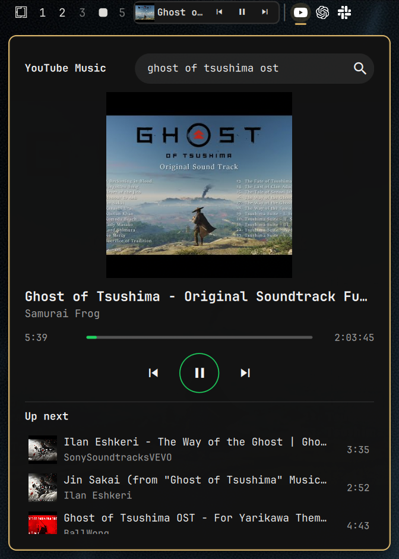

# YouTube Music for Omarchy

A compact, keyboard-first YouTube music player for Omarchy Quattro. Search
YouTube, play audio without opening a browser tab, and move through the current
result queue from a native Omarchy overlay.



## Features

- YouTube song, artist, and album search
- Audio-only playback through `mpv`
- Artwork, artist, and duration in the result list
- Play/pause, previous, and next controls
- A progress bar you can click and drag to seek, and a volume slider that
  remembers its level across tracks
- Mix: an endless station built from any track, the way "Start radio" works in
  the YouTube Music app
- Opening a song from search replaces the queue with that song's mix
- The queue plays through on its own, one track after the next
- Playlists, including a built-in "Liked songs" fed by the heart button
- Playlists open from the home screen and play as the queue
- Minimal top-bar now-playing player with artwork and previous/play/next controls
- Shared queue and playback state between the bar and full player
- Keyboard navigation
- Optional top-bar launcher
- Colors follow the active Omarchy theme, on a panel that stays dark

## Dependencies

The plugin requires `yt-dlp`, `mpv`, `socat`, and `jq`. They are present in a
standard Omarchy installation.

## Install

```sh
omarchy plugin add https://github.com/itsdotdev/omarchy-youtube-music.git --enable
```

Omarchy validates the manifest, installs the plugin, and places its widget in
the left section of the bar. To develop from a local checkout instead, run
`omarchy plugin add ./omarchy-youtube-music --enable`.

Open it from its bar icon or directly:

```sh
omarchy-shell shell toggle io.github.itsdotdev.youtube-music '{}'
```

To enable the plugin shortcuts, add this guarded loader to
`~/.config/hypr/bindings.lua`:

```lua
pcall(dofile, os.getenv("HOME") .. "/.config/omarchy/plugins/io.github.itsdotdev.youtube-music/hypr-bindings.lua")
```

Then run `hyprctl reload`.

The loader adds these desktop shortcuts:

- `Super + Ctrl + Shift + M` toggles the player.
- `Super + K` toggles search only while the player window is focused. Everywhere
  else it retains Omarchy's standard Keybindings menu action.

Inside the player, press Enter to search or play the selected result, use the
arrow keys to move through results, and press Escape to close it. With the
search field closed, Space toggles playback and the left and right arrows seek
five seconds. Click the artwork or track title to open the player; the compact
bar controls handle previous, play/pause, and next.

The `((*))` button next to the transport controls builds a mix around the track
on air; the same button appears on each row of the list on hover. Picking a
track from the search results does it automatically, so the queue becomes that
song's mix instead of the leftover search results. Once you are in a mix you
stay in it: it plays to the end unless you start another mix or search again.
Tracks already played stay in the list, dimmed, so you can go back to them.

## Theme

The player takes its colors from the active Omarchy theme, so switching themes
repaints it along with the rest of the shell. The panel itself stays dark
whatever the theme does: covers run edge to edge on it and the record is drawn
as a black disc, so a light background would leave the artwork washed out and
the grooves invisible. A dark theme's background is used as it is, hue
included; a light one is rebuilt at the same hue with the lightness pinned
down. The bar pill is the exception -- it lives in the bar and follows the
bar's own surface, light or dark.

## Playlists

The heart on the left of the transport row keeps the track on air in "Liked
songs", a playlist that is always there and cannot be deleted. The bookmark next
to the mix button opens a sheet listing every playlist, where each row toggles
the track in or out and "New playlist" creates one with that track already in
it.

The list icon in the header opens the home screen, which is also what you get
when nothing is playing. It lists the playlists with their covers and track
counts; a row opens the playlist, the play button on it starts the whole thing,
and `+` creates an empty one. Inside a playlist, a row plays from that point on
and the `x` on hover removes the track.

Playing a playlist makes it the queue as it stands: unlike opening a song from
search, no mix replaces it, because the list is one you built by hand.

Playlists are stored in `${XDG_DATA_HOME:-~/.local/share}/omarchy-youtube-music/playlists.json`
and survive reboots, unlike the queue and playback state, which live in
`XDG_RUNTIME_DIR` and go with the session. The volume sits alongside the
playlists, in `volume`: every track starts its own `mpv`, so without a stored
level it would snap back to the default on each song.

## Notes

This plugin uses public YouTube search results and does not sign in to a Google
account. Playback availability follows YouTube and `yt-dlp`; regional,
age-restricted, or account-only videos may not play.

## Remove

```sh
omarchy plugin remove io.github.itsdotdev.youtube-music
```

## License

MIT
